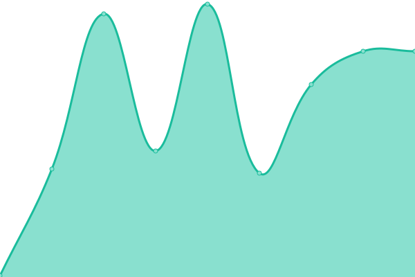
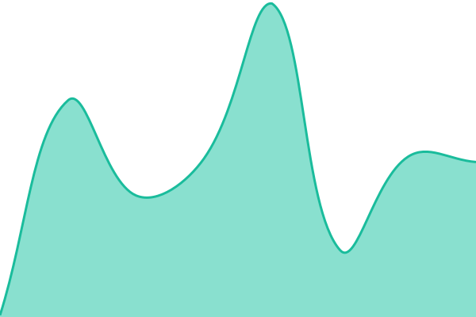

# [📈 Live Status](https://status.web-cited.com): <!--live status--> **🟩 All systems operational**

This repository contains the open-source uptime monitor and status page for [k0kesh](https://status.web-cited.com), powered by [Upptime](https://github.com/upptime/upptime).

With [Upptime](https://upptime.js.org), you can get your own unlimited and free uptime monitor and status page, powered entirely by a GitHub repository. We use [Issues](https://github.com/k0kesh/web-cited-status/issues) as incident reports, [Actions](https://github.com/k0kesh/web-cited-status/actions) as uptime monitors, and [Pages](https://status.web-cited.com) for the status page.

<!--start: status pages-->
<!-- This summary is generated by Upptime (https://github.com/upptime/upptime) -->
<!-- Do not edit this manually, your changes will be overwritten -->
<!-- prettier-ignore -->
| URL | Status | History | Response Time | Uptime |
| --- | ------ | ------- | ------------- | ------ |
|  [Marketing site](https://web-cited.com) | 🟩 Up | [marketing-site.yml](https://github.com/k0kesh/web-cited-status/commits/HEAD/history/marketing-site.yml) | 

 178ms
     
 | 

<a href="https://status.web-cited.com/history/marketing-site">100.00%</a>
    

|  [Marketing site (www)](https://www.web-cited.com) | 🟩 Up | [marketing-site-www.yml](https://github.com/k0kesh/web-cited-status/commits/HEAD/history/marketing-site-www.yml) | 

 186ms
     
 | 

<a href="https://status.web-cited.com/history/marketing-site-www">100.00%</a>
    

|  [Audit pipeline](https://audit.web-cited.com/audit/healthz) | 🟩 Up | [audit-pipeline.yml](https://github.com/k0kesh/web-cited-status/commits/HEAD/history/audit-pipeline.yml) | 

 281ms
     
 | 

<a href="https://status.web-cited.com/history/audit-pipeline">100.00%</a>
    

|  [Customer artifact CDN](https://artifacts.web-cited.com) | 🟩 Up | [customer-artifact-cdn.yml](https://github.com/k0kesh/web-cited-status/commits/HEAD/history/customer-artifact-cdn.yml) | 

 145ms
     
 | 

<a href="https://status.web-cited.com/history/customer-artifact-cdn">100.00%</a>
    

|  [Intake API](https://api.web-cited.com/health) | 🟩 Up | [intake-api.yml](https://github.com/k0kesh/web-cited-status/commits/HEAD/history/intake-api.yml) | 

 146ms
     
 | 

<a href="https://status.web-cited.com/history/intake-api">100.00%</a>
    

|  [Citation Monitor signup](https://web-cited.com/citation-monitor) | 🟩 Up | [citation-monitor-signup.yml](https://github.com/k0kesh/web-cited-status/commits/HEAD/history/citation-monitor-signup.yml) | 

 164ms
     
 | 

<a href="https://status.web-cited.com/history/citation-monitor-signup">100.00%</a>
    

|  [Citation Monitor manage](https://web-cited.com/citation-monitor/manage) | 🟩 Up | [citation-monitor-manage.yml](https://github.com/k0kesh/web-cited-status/commits/HEAD/history/citation-monitor-manage.yml) | 

 142ms
     
 | 

<a href="https://status.web-cited.com/history/citation-monitor-manage">100.00%</a>
    

|  [Citation Monitor portal route](https://api.web-cited.com/api/citation-monitor/portal) | 🟩 Up | [citation-monitor-portal-route.yml](https://github.com/k0kesh/web-cited-status/commits/HEAD/history/citation-monitor-portal-route.yml) | 

 97ms
     
 | 

<a href="https://status.web-cited.com/history/citation-monitor-portal-route">100.00%</a>
    

<!--end: status pages-->

[**Visit our status website →**](https://status.web-cited.com)

## 📄 License

- Powered by: [Upptime](https://github.com/upptime/upptime)
- Code: [MIT](./LICENSE) © [Anand Chowdhary](https://anandchowdhary.com), supported by [Pabio](https://pabio.com)
- Data in the `./history` directory: [Open Database License](https://opendatacommons.org/licenses/odbl/1-0/)
